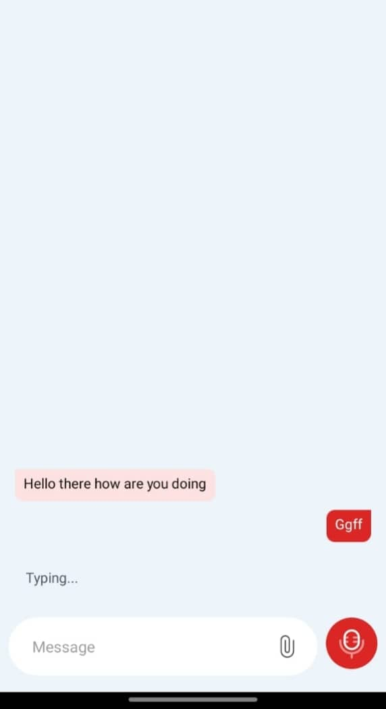

# React Native Modern Chats UI

A highly customizable, feature-rich chats interface component for React Native applications. Built with performance and flexibility in mind, this component provides a complete solution for implementing chats functionality in your mobile applications.

## Screenshots

<div align="center">
  
  
</div>

## Demo

<div align="center">
  
</div>

## ⚠️ Important Implementation Notes

- **Native Rebuild Required**: This package uses native modules that require rebuilding your application after installation.
- **Expo Go Compatibility**: This package is **not compatible** with Expo Go due to its native dependencies. You must use a development build or eject from Expo Go to use this library.
- **Development Build**: For Expo users, you'll need to create a [Development Build](https://docs.expo.dev/develop/development-builds/introduction/) to use this package.

## Features

- 🚀 Full TypeScript support
- 📱 Native performance optimizations
- 🎨 Extensive theme customization
- 🖼️ Multi-media message support (text, images, video, audio)
- 👤 Avatar and username display options
- ⌨️ Typing indicators
- 📎 File attachments
- 🎥 Camera integration
- 🎤 Voice messages
- 💬 Message status indicators (sent, delivered, read)
- 🎯 Custom component injection
- 🔧 Comprehensive styling API
- 🔄 Lazy loading for media messages
- 📡 Debounced typing indicators
- 🖼️ Avatar image caching

## Installation

```bash
npm install movius-chats
# or
yarn add movius-chats
```

### Required Dependencies

The following packages are required for movius-chats to function properly. Install them using npm or yarn:

```bash
# Using npm
npm install react-native-image-zoom-viewer react-native-reanimated react-native-sound react-native-svg react-native-video twrnc

# Using yarn
yarn add react-native-image-zoom-viewer react-native-reanimated react-native-sound react-native-svg react-native-video twrnc
```

### Additional Setup

For react-native-reanimated, add this line to your `babel.config.js`:

```javascript
module.exports = {
  plugins: ['react-native-reanimated/plugin'],
};
```

### Post-Installation Steps

After installing this package and its dependencies:

1. **For React Native CLI Projects**:
   ```bash
   npx pod-install  # For iOS
   npx react-native run-android  # Rebuild for Android
   npx react-native run-ios  # Rebuild for iOS
   ```

2. **For Expo Projects**:
   ```bash
   npx expo prebuild  # Generate native code
   npx expo run:android  # Build and run on Android
   npx expo run:ios  # Build and run on iOS
   ```

## Basic Usage

```typescript
import ChatScreen from 'movius-chats';
import { Message } from 'movius-chats/lib/typescript/types';
import { useState } from 'react';

const App = () => {
  const [messages, setMessages] = useState<Message[]>([]);

  const handleSendMessage = (message: Omit<Message, "id" | "time" | "status">) => {
    // Handle sending message
    const newMessage: Message = {
      ...message,
      id: Date.now().toString(),
      time: new Date().toLocaleTimeString(),
      status: 'sent'
    };
    setMessages(prev => [newMessage, ...prev]);
  };

  return (
    <ChatScreen
      messages={messages}
      currentUserId="user123"
      onSendMessage={handleSendMessage}
      showAvatars
    />
  );
};
```

## Props

### Core Props

| Prop | Type | Required | Description |
|------|------|----------|-------------|
| messages | Message[] | Yes | Array of message objects to display |
| currentUserId | string | Yes | ID of the current user |
| onSendMessage | (message: Omit<Message, "id" \| "time" \| "status">) => void | Yes | Callback when a message is sent |
| onMessageLongPress | (message: Message) => void | No | Callback for long-pressing a message |
| onAttachmentPress | () => void | No | Callback for attachment button press |
| onAudioRecordStart | () => void | No | Callback when audio recording starts |
| onAudioRecordEnd | () => void | No | Callback when audio recording ends |
| onCameraPress | () => void | No | Callback for camera button press |
| onTypingStart | () => void | No | Callback when user starts typing |
| onTypingEnd | () => void | No | Callback when user stops typing |
| placeholder | string | No | Input placeholder text |
| typingUsers | Array<{ id: string; avatar: string; name: string }> | No | List of users who are typing |

### Theming

The component supports extensive theming through the `theme` prop:

```typescript
 theme?: {
    colors?: {
      sentMessageTailColor?: string;
      receivedMessageTailColor?: string;
      timestamp?: string;
      inputsIconsColor?: string;
      sendIconsColor?: string;
      placeholderTextColor?: string;
      audioPlayIconColor?: string;
      audioPauseIconColor?: string;
      videoPlayIconColor?: string;
    };
    bubbleStyle?: {
      sent?: ViewStyle;
      received?: ViewStyle;
      avatarTextStyle?: TextStyle;
      userNameStyle?: TextStyle;
      avatarImageStyle?: ImageStyle;
      typingContainerStyle?: ViewStyle;
      additionalTypingUsersContainerStyle?: ViewStyle;
      additionalTypingUsersTextStyle?: TextStyle;
    };
    messageStyle?: {
      sentTextStyle?: TextStyle;
      receivedTextStyle?: TextStyle;
      audioPlayButtonStyle?: ViewStyle;
      audioKnobStyle?: ViewStyle;
      progressBarStyle?: ViewStyle;
      activeProgressBarStyle?: ViewStyle;
      audioDurationStyle?: TextStyle;
    };
    inputStyles?: {
      inputSectionContainerStyle?: ViewStyle;
      inputContainerStyle?: ViewStyle;
      sendButtonStyle?: ViewStyle;
    };
  };
```

### Custom Components

| Prop | Type | Description |
|------|------|-------------|
| renderCustomInput | () => React.ReactNode | Custom input component |
| renderCustomVideoBubbleError | () => React.ReactNode | Custom video error display |
| renderCustomTyping | () => React.ReactNode | Custom typing indicator |
| CustomEmojiIcon | () => React.ReactNode | Custom emoji picker icon |
| CustomAttachmentIcon | () => React.ReactNode | Custom attachment icon |
| CustomCameraIcon | () => React.ReactNode | Custom camera icon |
| CustomSendIcon | () => React.ReactNode | Custom send button icon |
| CustomMicrophoneIcon | () => React.ReactNode | Custom microphone icon |
| CustomPlayIcon | () => React.ReactNode | Custom play icon |
| CustomPauseIcon | () => React.ReactNode | Custom pause icon |

## Advanced Usage

### Custom Theme Example

```typescript
<ChatScreen
  messages={messages}
  currentUserId="user123"
  onSendMessage={handleSendMessage}
  theme={{
    colors: {
      sentMessageTailColor: '#007AFF',
      receivedMessageTailColor: '#E9E9EB',
      timestamp: '#8E8E93',
    },
    bubbleStyle: {
      sent: {
        backgroundColor: '#007AFF',
        borderRadius: 20,
      },
      received: {
        backgroundColor: '#E9E9EB',
        borderRadius: 20,
      },
    },
  }}
/>
```

### Expo Usage

If you're using Expo, follow these steps:

1. Create a development build of your app:
   ```bash
   npx expo prebuild
   ```

2. Run on your desired platform:
   ```bash
   npx expo run:android
   # or
   npx expo run:ios
   ```

3. For subsequent updates to the native modules, you'll need to rebuild:
   ```bash
   npx expo prebuild --clean
   ```

### Performance Considerations

- Messages are rendered using `FlatList` for optimal performance
- Avatar images are cached automatically
- Media messages use lazy loading
- Typing indicators are debounced

## Troubleshooting

### Common Issues

- **"Native module not found" error**: Ensure you've rebuilt your app after installing the package.
- **Crashes in Expo Go**: This package uses native modules that are not compatible with Expo Go. Use a development build instead.
- **Audio/Video not working**: Check that you've installed all required dependencies and rebuilt the app.

## Contributing

We welcome contributions! Please see our contributing guide for details.

## License

MIT

## Support

For issues and feature requests, please file an issue on the GitHub repository.